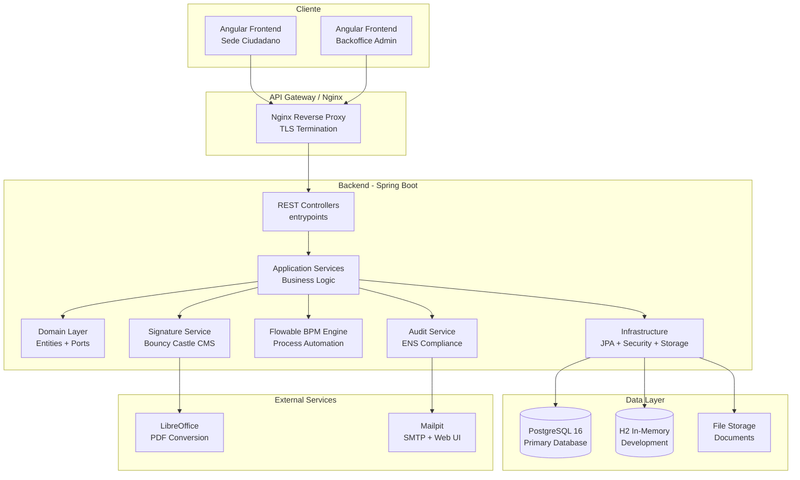
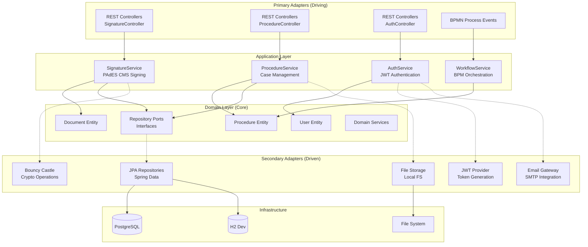
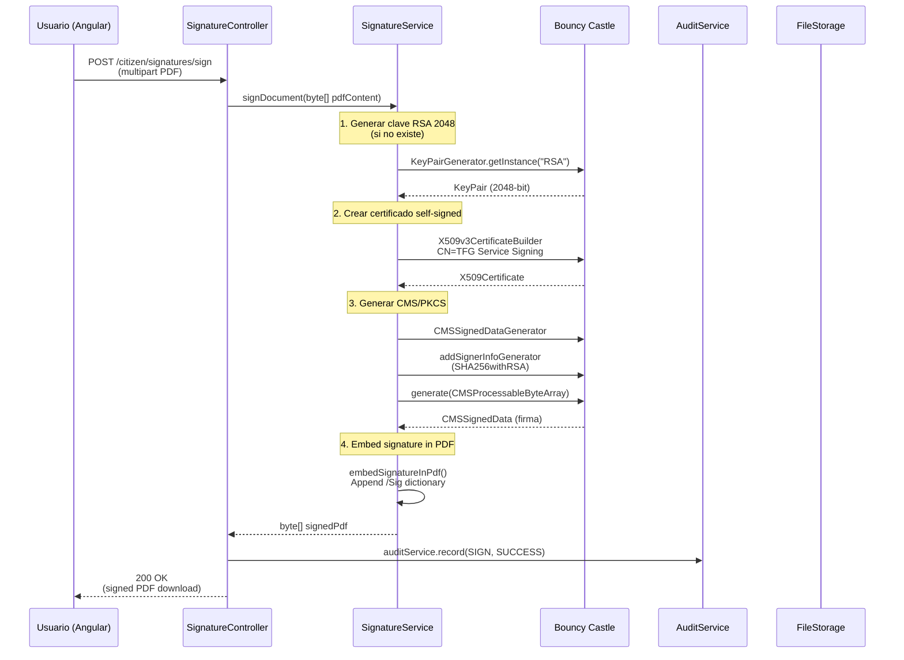
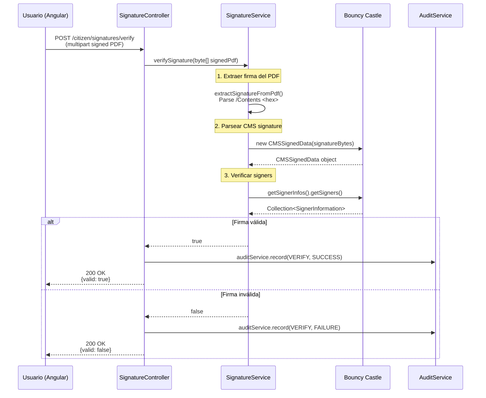
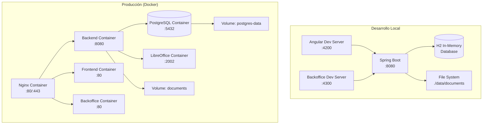
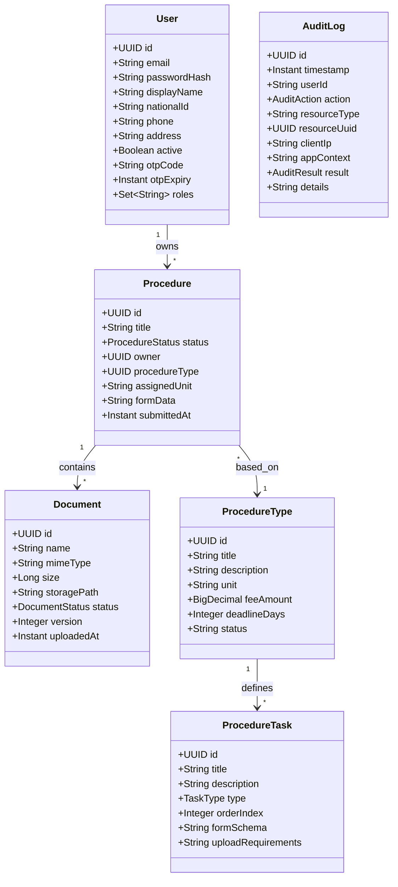
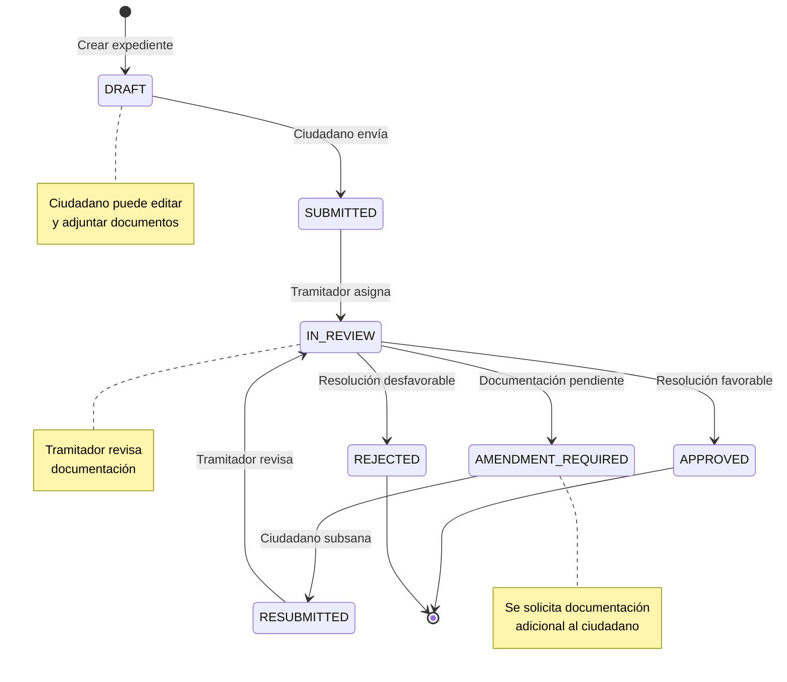
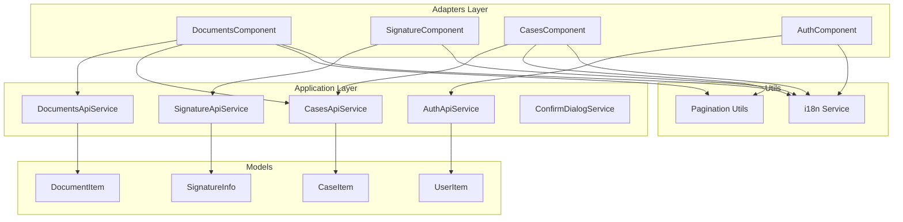
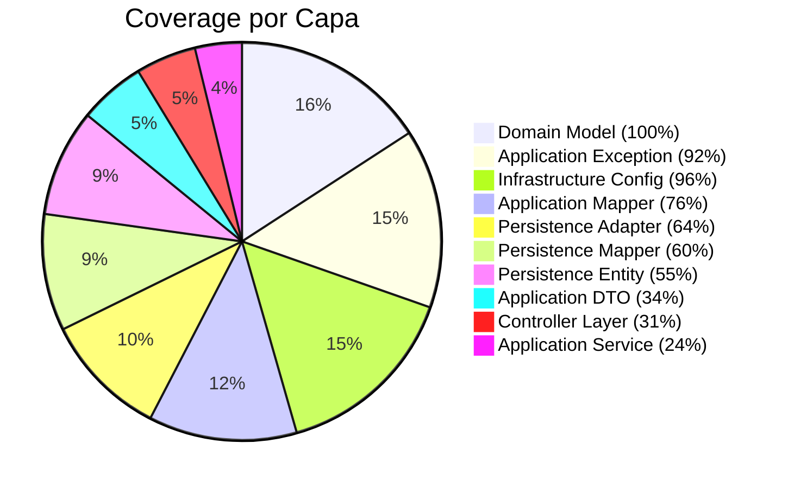

# TFG Records Platform - Diagramas de Arquitectura

## 1. Arquitectura General del Sistema

## 2. Arquitectura Hexagonal (Ports & Adapters)

## 3. Diagrama de Secuencia - Firma Electrónica

## 4. Diagrama de Secuencia - Verificación de Firma

## 5. Diagrama de Despliegue

## 6. Modelo de Dominio - Entidades Principales

## 7. Flujo de Estado de Expediente

## 8. Componentes del Frontend (Angular)

## 9. Cobertura de Tests (JaCoCo)

## 10. Security Filter Chain

```mermaid
graph LR
    A[Request] --> B[DisableEncodeUrlFilter]
    B --> C[WebAsyncManagerIntegrationFilter]
    C --> D[SecurityContextHolderFilter]
    D --> E[HeaderWriterFilter]
    E --> F[CorsFilter]
    F --> G[LogoutFilter]
    G --> H[CorrelationIdFilter]
    H --> I[SecurityHeadersFilter]
    I --> J[RateLimitFilter]
    J --> K[JwtAuthenticationFilter]
    K --> L[RequestCacheAwareFilter]
    L --> M[SecurityContextHolderAwareRequestFilter]
    M --> N[AnonymousAuthenticationFilter]
    N --> O[SessionManagementFilter]
    O --> P[ExceptionTranslationFilter]
    P --> Q[AuthorizationFilter]
    Q --> R[Controller]
```

